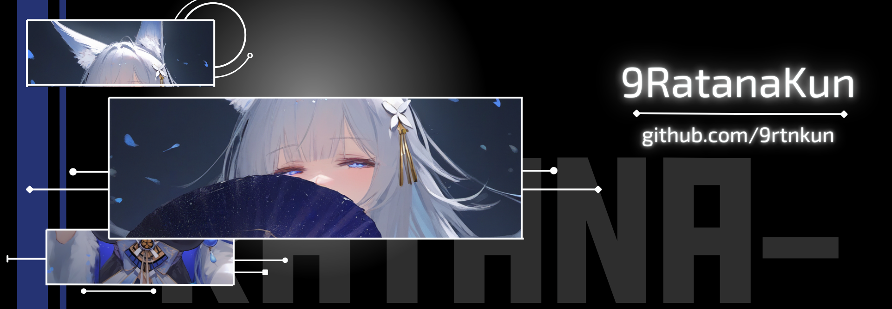

Hello World! My name is Ratana Rattanaburee 
============================================

B.Eng.Com Software Engineer Junior Student Dev.
--------------------------------------------

I've always loved games and anime. Seeing new innovations inspired me to start creating things myself. Now I'm learning and building step by step! (b°v°)b

* 🌍  I'm based in Thailand

## Skills:

 
 
 

 

## Socials

## GitHub Stats:

---

### Support Me
<ul style="list-style-type: none; margin: 0;">
<li style="display: inline-block; margin-right: 0.25rem;"></li>
</ul>
